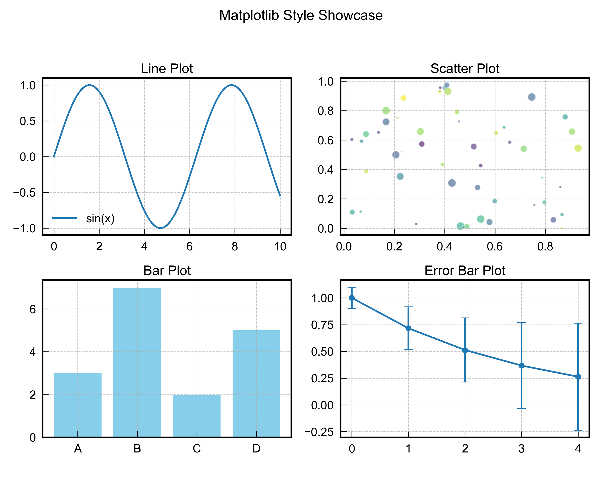

# Suggested Matplotlib practices 

## 1. use style sheet for global style control
This is for controlling the most common feature of a plot. Such as:
1. font size and family
2. grid lines
3. sizes for labels, ticks labels and titles
4. legend settings (frameon, facecolor and edgecolor)
5. default linewidth for lines (and other plots: bars, errorbars etc.)
6. ticks settings

```python
import matplotlib.pyplot as plt
plt.style.use('mystyle.mplstyle')
```

Some examples:


## 2. some good examples
Most examples are from: https://github.com/rougier/scientific-visualization-book

(with some of my own changes)

1. `colorbar.py` and `color_equalheight.py`: How to set the colorbar have the same height as its parent subplot?
2. `title-regular.py`: an example of styling title, spline, xlabel and ticks.
3. `scatter2d_distribution.py`: 2D scatter with separate X and Y direction histograms.
4. `annotation-direct.py`: an `annotate` example using arrows and text to point to data points.
5. `legend-alternatives.py`: different ways to annotate legend.
6. `complex-layout.py`; a complex example of using `GridSpec` for layout.
7. `annotation-side.py`: a more advanced text annotation for data points.
8. `annotation-zoom.py`: annotation of zoom-in sub-regions of a parent plot. 


